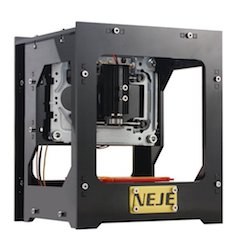
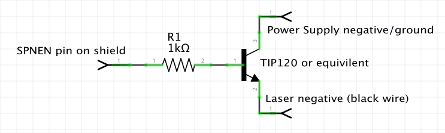
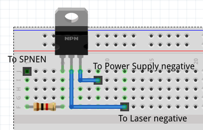

# neje-laser-upgrades
How-to's and resources for upgrading the NEJE (also sold under the HICTOP brand, and others) desktop USB laser engraver to full GRBL compatibility by replacing
the electronics.

Last updated January, 2018.

## Full grbl upgrade with Arduino CNC Shield

### Videos

I have uploaded a video of the whole upgrade process at [youtu.be/2rbzI-d-bOA](https://youtu.be/2rbzI-d-bOA).

A second video with specific focus on the wiring, and that covers use of a
MOSFET to switch the laser, is also available at [https://youtu.be/MuKYvifYnYs](https://youtu.be/MuKYvifYnYs).

### Links to resources

#### Software-only upgrade

If you are lucky enough to have a machine that can be upgraded without replacing
the board, you can follow [these instructions](http://diyhpl.us/laser_etcher/NEJE_Laser_Etcher/)
to flash a new version of grbl to it.

#### Hardware



The engraver pictured above and in the video: [KKmoon NEJE DK-8-KZ 1000mW](https://www.amazon.com/gp/product/B01EACK7UG/ref=oh_aui_detailpage_o05_s02)

The Arduino shield used to control the steppers: [Arduino CNC Shield](http://blog.protoneer.co.nz/arduino-cnc-shield/).
I think I mistakenly referred to this as "grblshield" in the video.

[Arduino Uno](https://www.arduino.cc/en/Main/ArduinoBoardUno), the board that connects to the shield above.

[Laser focus adjustment ring](http://www.thingiverse.com/thing:1939313).

[IRF520 module](https://www.amazon.com/gp/product/B00Z8UF6AQ), the board that
controls power to the 5V laser.

#### Software

[Universal Gcode Sender](https://github.com/winder/Universal-G-Code-Sender) -
Used to send commands to the laser.

[J Tech Photonics Laser Tool](https://jtechphotonics.com/?page_id=2012) -
Used to convert images to laser commands.

#### Wiring diagrams and schematics

##### Connecting PC power supply to Arduino and Shield

The CNC shield can accept any DC voltage from 12V to 36V. Because the stepper
motors used here are very small, the 12V does not need to be high amperage;
500ma or larger will probably be sufficient.


To power the upgrade, I used a power supply designed to run an internal PC
hard drive, although a full-size PC power supply would work.


The most important part of the power supply is that is can give 5V at several
amps to power the laser.

The CNC shield electronics can then be powered from 5V as well, but I chose
to power them from the 12V rail of the power supply. If you choose to do that,
you will want to adjust the current-limit on the drivers to avoid damaging the
stepper motors. Details of how to do this are in the video.

##### Connecting stepper motors to the shield

The connector for the stepper motors are between the "drivers" (the red square
  circuit boards [in this image](images/CNC%20Shield%20Annotated%20resized.JPG).

With the white wire facing up, match the 4-pin connector on the cable to the
4-pin connector on the board for both the X- and Y-axis.


##### Connecting laser to power supply and CNC shield

The `SPNEN` (SPiNdle ENable) pin on the shield cannot power the laser itself, so
I use a circuit with a transistor to power the laser from the power supply, but
still allow it to be turned on and off by the CNC shield.

First, you will connect the positive wire of the laser (coloured red on mine) to
the 5V power line from your power supply. It *MUST* be 5V, any more will damage
the laser!

We will switch the laser on and off by connecting or disconnecting the
negative/ground wire. This technique is known as "[low-side switching](https://learn.sparkfun.com/tutorials/transistors/applications-i-switches)".

Here are two ways to do it, though there are probably other ways too. I
recommend using a MOSFET over a TIP120. But if you only have a TIP120 it will
still work though your laser power may suffer.

###### MOSFET circuit

An efficient way to switch the laser on and off is to use an N-Channel Power
MOSFET. Currently I am using an [IRF520 module like this one](https://www.amazon.com/gp/product/B00Z8UF6AQ), but this is not designed for logic-level switching so if you have the option I would
recommend using [a logic-level MOSFET](https://www.mouser.com/ProductDetail/512-FQU13N10LTU) instead.

But, regardless of the voltage, if you want to solder one yourself then the
circuit will look something like this:


This will switch the laser on and off with a minimum of voltage loss.

If you use the same IRF520 module that I did, here is how the wires are
connected:


###### TIP120 circuit

Before using the MOSFET, I was using a TIP120 Darlington transistor. This works
but it is a poor choice because the voltage drop on a TIP120 can be as much as
2V in some cases. If we were switching 48V then that wouldn't be a problem but
for a 5V laser, losing even 1V is going to severely impact laser power.

Here is the TIP120 switching circuit I used before:





The transistor I used is a TIP120 "Darlington" transistor. It is a very common
"power transistor" that you can find at any electronics shop (Radio Shack,
Fry's, etc) and everywhere online. You can use any similar NPN-type power
transistor (such as the TIP31, etc) as long as it can handle the current. A
standard 2N3904 transistor can't handle it, and while a 2N2222 *may* be able to
handle it for lower-powered lasers, I would still recommend using a TIP-series transistor because they are still very inexpensive.

**Note**: I should really upgrade the above circuit to use a MOSFET instead
of a power transistor. It shouldn't be that hard adapt it using
[the example from this page](http://www.sensitiveresearch.com/elec/DoNotTIP/index.html). It may also
let us use PWM to control the intensity of the laser.

### Orientation

The origin (X/Y at 0) coordinates should be at the lower-left of the of the
stage. "Lower" here means nearest to front. Make sure moving each axis
negatively will move toward that point, and moving each axis positively will
move away from that point.

### configuring grbl to work in positive space

For J Tech Photonics Laser Tool (in Inkscape), make sure to set the machine
coordinates system to operate in positive space. You will do that by
uncommenting the following line in `config.h` before you upload the grbl
code to the Arduino:

```
#define HOMING_FORCE_SET_ORIGIN
```

### grbl 1.1 settings for Arduino CNC Shield upgrade

```
Grbl 1.1e [‘$’ for help]
$0=10
$1=25
$2=0
$3=0
$4=0
$5=0
$6=0
$10=1
$11=0.010
$12=0.002
$13=0
$20=0
$21=0
$22=0
$23=0
$24=25.000
$25=500.000
$26=250
$27=1.000
$30=1000
$31=0
$32=0
$100=108.000
$101=108.000
$102=250.000
$110=5000.000
$111=5000.000
$112=500.000
$120=500.000
$121=500.000
$122=10.000
$130=27.000
$131=37.000
$132=200.000
```

### Reset default work area

You will probably need to reset the default "work area". Do that with these
two commands:

```
G10 L2 P1 X0 Y0 Z0
G54 X0 Y0 Z0
```
